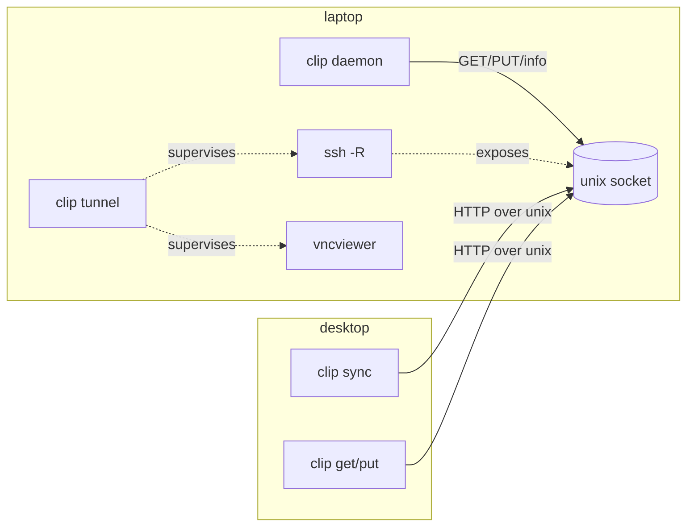

# Architecture: `clip` — Go rewrite of the clip + remote-desktop tooling

Status: PROPOSAL-1 (draft)
References: REQUEST `plabs-wn1`, ELICIT `plabs-1zs`, URD `plabs-ebt`

## 1. Context

Today the clipboard + remote-desktop tooling is split across Python and shell:

| Artifact | Language | Role |
|---|---|---|
| `modules/home-manager/services/clipd/clipd.py` | Python | `clipd`: HTTP-over-unix-socket daemon serving the laptop's `wl-clipboard` (`GET`/`PUT`/`info`) |
| `packages/clip/clip.py` | Python | `clip` CLI: `get`/`put`/`info`/`ping` against a peer socket |
| `packages/clip/clip-sync.py` | Python | Bidirectional reconciler between a local clipboard and a peer |
| `modules/home-manager/programs/remote-desktop/default.nix` | inline shell | Laptop `remote-desktop`: launches the VNC viewer and supervises an `ssh -R` for the clipd socket |
| `modules/nixos/services/remote-session/default.nix` | inline shell | Desktop persistent sway + wayvnc session; runs `clip-sync` against the session |

This works but requires a Python runtime, has shell-based lifecycle management, and is awkward to distribute. The goal is one small, static, testable Go binary with the same behavior, plus a clear design a new team can implement.

## 2. Goals / non-goals

**Goals** (from URD `plabs-ebt`)
- G1. Parity: text `text/plain` + `image/png`; bidirectional sync with no feedback loop.
- G2. Single multi-call Go binary `clip`, static (`CGO_ENABLED=0`), cross-compilable.
- G3. Include the tunnel manager by supervising the external `ssh` binary and the viewer.
- G4. YAML config + flags; structured logging; graceful shutdown.
- G5. Package via `buildGoModule`; portable release binaries + systemd unit templates.
- G6. Hand-off quality: documented interfaces, unit + integration tests, release process.

**Non-goals**
- N1. No native Go SSH transport/auth (no `golang.org/x/crypto/ssh` remote-forward).
- N2. No new wire protocol/transport (no TCP/TLS/token auth this iteration).
- N3. No Go rewrite of the NixOS/home-manager module wiring.
- N4. No port of the remote-session sway/wayvnc wrappers or general `scripts/` glue.
- N5. No TUI and no clipboard-history storage: `clipse` remains the history manager/TUI; our tools must coexist with it on the same session clipboard.
- N6. No `sd_notify`/`Type=notify` this iteration (deferred; see §19).

## 3. Problem space

- **Axes:** distribution (portability + Nix), reliability (sync convergence, tunnel lifecycle), ergonomics (single binary, config).
- **Is-a / has-a:** `clip` *is* a multi-call CLI; *has* a daemon mode (server), a client mode, a reconciler, and a tunnel manager. The reconciler *has* two clipboard endpoints (`local`, `peer`). The tunnel manager *has* an ssh master, a forward, and a supervised viewer.
- **Trust model:** the peer socket is a unix socket in the user's runtime dir, exposed to the peer via `ssh -R`. No app-layer auth; transport security is ssh. (Hardening this is future work, not this iteration.)

## 4. Architecture overview

```
              laptop (flowX13)                         desktop
  ┌───────────────────────────────────┐   ┌────────────────────────────────────┐
  │ session clipboard (Wayland)       │   │ remote-session clipboard (sway)    │
  │   ▲ wl-paste / wl-copy            │   │   ▲ wl-paste / wl-copy             │
  │   │                               │   │   │                                │
  │ clip daemon  ── unix socket ──┐   │   │ clip sync ── HTTP over unix ──┐    │
  │ (serves local clipboard)      │   │   │ (reconciler)                 │    │
  └───────────────────────────────┼───┘   └──────────────────────────────┼────┘
                                  │ ssh -R (supervised by `clip tunnel`) │
                                  ▼                                      ▼
                        /run/user/1000/clipd.sock  ◀── same path ──▶  peer socket
```

`clip` is one binary; the subcommand selects the mode:



## 5. Components

### 5.1 `clip daemon` (former `clipd`)
HTTP/1.1 server on a unix socket serving the local clipboard.

- `GET /clip` → `200 {"type":T,"data":base64}` or `204` if empty. Auto mode returns the first **non-empty** `text/plain`, else `image/png` (fixes the old empty-text-shadows-image bug).
- `GET /clip?type=T` → `200` / `204` / `415`.
- `GET /info` → `200 {"types":[...]}` (always includes both supported types).
- `PUT /clip` `{"type":T,"data":base64}` → `200 {"ok":true}` / `400` / `413` (body cap) / `415` / `500`.
- Socket created mode `0600`; stale socket removed before bind iff not listening.

Implementation: `net.Listen("unix", …)` + `net/http` (`http.Serve`), request size limited via `http.MaxBytesReader`.

### 5.2 `clip get|put|info|ping` (client)
Same CLI and exit codes as today. `get` writes raw bytes to stdout; `put` reads stdin; `ping` is `GET /info` with a short timeout; `--socket`/config override.

### 5.3 `clip sync` (reconciler)
Bidirectional, loop-free, via one "last agreed" content hash:

```
last = hash(peer) if peer non-empty else hash(local)     # seed: never clobber peer at startup
loop every interval:
    peer  = peerRead()      # GET /clip   -> (type, bytes) | nil
    local = localRead()     # non-empty text/plain else image/png, via wl-paste
    if peer != nil and hash(peer) != last:
        localWrite(peer); last = hash(peer)
    elif local != nil and hash(local) != last:
        peerPut(local);   last = hash(local)
```

- Representation choice is identical on both sides (non-empty text, else PNG), so hashes are comparable.
- A value that arrived from the peer is never pushed back.
- Peer/local read errors are tolerated and retried (tunnel may be down).

### 5.4 `clip tunnel` (remote-desktop orchestration)
Owns the lifecycle that is currently shell:

1. Resolve config (`host`, `ssh` path, local/remote socket paths, viewer argv).
2. Ensure a persistent ssh master on a dedicated `ControlPath` (create with `ControlMaster=yes ControlPersist=yes`, `-fN`; not `-f` for auth if a passphrase may be needed — see §8).
3. Add the forward: `ssh -O forward -R <remote>:<local> <host>`; fail cleanly on error.
4. Exec/supervise the viewer (`vncviewer host:port`).
5. On viewer exit or `SIGINT`/`SIGTERM`/`SIGHUP`: `ssh -O cancel -R <remote>:<local> <host>`; leave the master per `ControlPersist`.
6. Return the viewer's exit code; log each step as JSONL.

The master persists so the passphrase is entered at most once; the forward exists only while the viewer runs.

## 6. CLI surface

Parsed and presented with `charmbracelet/fang` (Cobra-based): styled help, `--version`/commit, and man pages. Subcommands remain stable.

```
clip [--config PATH] <command> [flags]

  daemon    [--socket PATH] [--log-level L]
  get       [TYPE] [--socket PATH]
  put       [TYPE] [--socket PATH]
  info|ping [--socket PATH]
  sync      [--socket PATH] [--interval DUR] [--types a,b]
  tunnel    [--host H] [--ssh PATH] -- <viewer argv...>
  version
```

`--socket` defaults to the config `socket`, else `/run/user/<uid>/clipd.sock`.

## 7. Configuration (YAML) + flags

Precedence: flags > env > config file > defaults. Default path: `$XDG_CONFIG_HOME/clip/config.yaml`.

```yaml
# ~/.config/clip/config.yaml
socket: /run/user/1000/clipd.sock
types: [text/plain, image/png]
sync:
  interval: 1s
clipboard:
  # Optional explicit paths; default resolves wl-copy/wl-paste from PATH.
  wl_copy: wl-copy
  wl_paste: wl-paste
log:
  level: info          # error|warn|info|debug
  format: jsonl        # jsonl|text
tunnel:
  host: desktop
  ssh: ssh
  local_socket: /run/user/1000/clipd.sock
  remote_socket: /run/user/1000/clipd.sock
  viewer: [vncviewer]
```

Dependency: `gopkg.in/yaml.v3` (pure Go, static-friendly).

## 8. Logging, signals, exit codes

- Logging: stdlib `log/slog` with the JSON handler to stderr for `daemon`/`sync`; `charmbracelet/log` (styled) is optional for interactive commands. Never log clipboard contents; one event per state change (bind, request error, sync write, tunnel add/cancel).
- Signals: `SIGINT`/`SIGTERM` → graceful shutdown (stop accepting, cancel forward, kill supervised children). `SIGHUP` in `tunnel`/`sync` → same teardown (no orphaned ssh).
- Exit codes: `0` success; `1` runtime error; `2` usage; `3` peer/tunnel unreachable (mirrors current "cannot reach daemon").
- Auth: the tunnel uses key/agent auth; if a passphrase is required and no agent holds the key, ssh prompts once to create the master.

## 9. Systemd + Nix integration

Map 1:1 onto today's units, replacing the Python wrapper with `clip`:

| Unit | Today | After |
|---|---|---|
| `clipd.service` (user) | `python3 clipd.py %t/clipd.sock` | `clip daemon --config %t/clip.yaml` |
| `clip-sync.service` (user, login session) | `clip-sync <socket> <interval>` | `clip sync --config %t/clip.yaml` |
| `clip-peer-sync.service` (system, remote-session) | `clip-sync <socket> <interval>` | `clip sync --config /run/user/<uid>/remote/clip.yaml` |

- Readiness stays `Type=simple` with the existing `StartLimitIntervalSec=0` + retry settings; `sd_notify`/`Type=notify` is explicitly deferred (N6).

Nix: `pkgs.buildGoModule` (or `buildGoApplication` with `gomod2nix`) producing `clip`; modules reference `${clip}/bin/clip`. Add `vendorHash` and update on dependency changes.

## 10. Distribution

- Static: `CGO_ENABLED=0 go build ./...`; matrix `{linux,darwin}×{amd64,arm64}` via a small release workflow (`goreleaser` or a Make target). Note: functionality is Linux/Wayland + ssh; darwin builds are for the client only if desired.
- Release artifacts: tarballs with `clip`, example `config.yaml`, and `contrib/*.service` unit templates.
- Nix: flake package `clip` + cache; modules consume it.

## 11. Security

- Socket is `0600` in the user runtime dir; only same-user processes (or the peer tunnel) can connect.
- Transport security is ssh; no app-layer auth this iteration (documented; future: token/TLS).
- The tunnel exposes the local clipboard to the peer while the forward exists; `cancel` on exit limits the window.
- Do not log clipboard contents.

## 12. Testing strategy

- **Unit:** protocol handlers (status codes, empty vs missing, 415/413), reconciler transitions (seed, peer→local, local→peer, no-loop on echo), config precedence, CLI parsing.
- **Integration:** in-process unix socket client/server; a fake `wl-copy`/`wl-paste` (the existing mock harness) to prove bidirectional convergence and image handling with no feedback loop.
- **Tunnel:** a fake `ssh` executable on `PATH` that records `-O forward`/`-O cancel` and a fake viewer; assert add/cancel on exit and on signals; assert no orphaned child on `SIGHUP`.
- **E2E (scripted):** laptop daemon + desktop sync over a local unix socket pair simulating the tunnel.

## 13. Migration / cutover

1. Land `packages/clip-go/` with parity tests; keep Python in place.
2. Switch the three systemd units to `clip`; run both side by side in a staging host.
3. Remove `clipd.py`, `clip.py`, `clip-sync.py` and the Python packaging.
4. Update docs (`docs/remote-clipboard.md`) and units.
Rollback: revert units to the Python wrappers (store paths remain until GC).

## 14. Engineering tradeoffs

| Decision | Pros | Cons | Choice |
|---|---|---|---|
| Single binary vs several | one artifact, shared config/logging | bigger single unit; subcommand dispatch | single (D2) |
| YAML vs TOML vs flags-only | YAML already used in repo tooling, expressive | extra dep (`yaml.v3`) | YAML (D3) |
| Supervised ssh vs native Go SSH | reuses ssh hardening/config/agent; days vs weeks | depends on `ssh` binary behavior | supervised (D1) |
| Go vs Zig | stdlib + ecosystem; trivial static | larger binaries than Zig | Go |
| Monorepo vs separate repo | simplest wiring; same CI | less clean external handoff | monorepo (D4) |

## 15. Public interfaces (Go)

```go
package clip // protocol types

type Type string
const ( Text Type = "text/plain"; PNG Type = "image/png" )

type Data struct { Type Type; Bytes []byte }

// package ctl — client for the daemon protocol
type Client struct{ Socket string; HTTP *http.Client }
func (c *Client) Get(ctx context.Context, t Type) (Data, bool, error) // bool=false => 204
func (c *Client) Put(ctx context.Context, d Data) error
func (c *Client) Info(ctx context.Context) ([]Type, error)

// package clipboard — local clipboard backend
type Clipboard interface {
    Read(ctx context.Context) (Data, bool, error)  // non-empty text/plain, else image/png
    Write(ctx context.Context, d Data) error
}
func NewWLClipboard(copyBin, pasteBin string) Clipboard

// package sync
type Peer interface { Read(ctx context.Context) (Data, bool, error); Write(ctx context.Context, d Data) error }
type Reconciler struct { Local Clipboard; Peer Peer; Interval time.Duration; Log *slog.Logger }
func (r *Reconciler) Run(ctx context.Context) error

// package tunnel
type Tunnel struct { SSH, Host, Local, Remote string; Viewer []string; Log *slog.Logger }
func (t *Tunnel) Run(ctx context.Context) (int, error) // ensures master, adds forward, supervises viewer, cancels
```

## 16. Validation checklist

- [ ] `clip daemon` binds a unix socket `0600`, prunes a stale socket, and answers `GET /clip`, `GET /clip?type=`, `GET /info`, `PUT /clip` with parity errors (`400/413/415`).
- [ ] `clip get`/`put` round-trip text and PNG over a unix socket.
- [ ] `clip sync` converges both directions and does not echo (mock two-clipboard harness).
- [ ] Empty `text/plain` alongside `image/png` yields the image from the daemon.
- [ ] `clip tunnel` creates a persistent master, adds `-R`, and on viewer exit / SIGINT / SIGTERM / SIGHUP cancels the forward and leaves no orphaned child.
- [ ] Config precedence (flag > env > file > default) and YAML parsing.
- [ ] Static build: `CGO_ENABLED=0 go build` produces a binary with no dynamic deps (`ldd` "not a dynamic executable").
- [ ] `buildGoModule` evaluates and builds in the flake; modules reference `${clip}/bin/clip`.
- [ ] Structured JSONL logs on stderr with no clipboard contents.

## 17. BDD acceptance criteria

- **Given** a laptop daemon and a desktop reconciler over a unix socket, **When** the user copies `hello` on the laptop, **Then** the desktop clipboard becomes `hello`, **And Should Not** push it back.
- **Given** the desktop clipboard changed to `world` and the peer still holds `hello`, **When** the next sync tick runs, **Then** `world` is written to the peer, **And Should Not** echo `world` back to the desktop.
- **Given** the peer clipboard offers an empty `text/plain` plus `image/png`, **When** `GET /clip` is requested, **Then** the response is the PNG, **And Should Not** return empty text.
- **Given** an unsupported MIME type, **When** `PUT /clip` is called, **Then** the daemon returns `415`, **And Should Not** alter the clipboard.
- **Given** `clip tunnel` with a running viewer, **When** the viewer exits or the process receives `SIGHUP`, **Then** the `-R` forward is cancelled and no ssh child remains, **And Should Not** require re-authentication on the next launch (persistent master).
- **Given** a build with `CGO_ENABLED=0`, **When** the binary is inspected, **Then** it has no dynamic library dependencies, **And Should Not** require a Python runtime.

## 18. Risks / open questions

- R1. `ssh -O forward` availability/semantics across OpenSSH versions (target ≥ 8.x); fallback to a dedicated `-fN -R` connection if `-O` is unsupported.
- R2. `log/slog` requires Go ≥ 1.21; confirm the toolchain pinned in the flake.
- R3. YAML adds a dependency; if zero-deps is a hard requirement, fall back to flags/env + a minimal parser.
- R4. Two reconcilers (login session + remote session) sharing one peer can contend last-writer; out of scope but document.
- R5. Release workflow target set (darwin client-only vs full matrix) needs a decision before packaging.

## 19. Dependencies and library choices

| Area | Choice | Notes |
|---|---|---|
| CLI | `charmbracelet/fang` (Cobra + Lipgloss + Glamour) | subcommands, styled help, `--version`/commit, man pages |
| Config | `knadh/koanf` (+ YAML provider) | precedence flag > env > file > default without hand-rolled merge |
| XDG paths | `adrg/xdg` | `$XDG_CONFIG_HOME`/`$XDG_RUNTIME_DIR`; no hardcoded `/run/user/1000` |
| Concurrency | `golang.org/x/sync/errgroup` | daemon/sync/tunnel goroutine lifecycle and cancellation |
| Logging | stdlib `log/slog` (JSONL) for daemon/sync; optional `charmbracelet/log` for interactive mode | never log clipboard contents |
| Testing | stdlib `testing` + `google/go-cmp` | table tests + the mock `wl-clipboard` harness |
| Release | `goreleaser` (tooling) | static matrix, checksums, unit templates |

Explicitly **not** adopted:
- `bubbletea`/`bubbles`/`lipgloss` as a TUI — no `clip tui`; `clipse` remains the history/TUI. (Lipgloss/Glamour still arrive transitively via `fang`.)
- `github.com/coreos/go-systemd/v22/daemon` (`sd_notify`) — sensible and well-maintained, but judged overkill for now; keep `Type=simple`. Revisit only if a startup race appears.
- Any third-party SSH library — the tunnel supervises the `ssh` binary.

All are pure Go, so `CGO_ENABLED=0` static builds remain valid. Nix vendoring via `buildGoModule` `vendorHash` (or `gomod2nix`).

## 20. Project layout (inspired by `clipse`)

Adapted from `savedra1/clipse`'s shape (`cmd/`, `config/`, `display/`, `handlers/`, `shell/`, `utils/`) to our transport/sync roles and Go's `internal/` convention:

```
packages/clip-go/
  go.mod                # module: github.com/dayvidpham/dotfiles/packages/clip-go (extractable later)
  cmd/clip/main.go      # fang entrypoint; wires subcommands
  internal/
    cli/                # fang command definitions: daemon, get, put, info, ping, sync, tunnel
    config/             # koanf load + precedence + schema
    protocol/           # wire types (Data, Type), request/response encoding
    daemon/             # HTTP-over-unix-socket server
    ctl/                # client for the daemon protocol
    clipboard/          # local clipboard backend
      clipboard.go      #   Clipboard interface
      wl.go             #   wl-clipboard implementation (wl-copy/wl-paste)
      types.go          #   magic-byte sniffing (PNG/JPEG), MIME constants
    shell/              # command construction/constants (argv builders) — unit-testable
    sync/               # reconciler (last-hash algorithm)
    tunnel/             # supervised ssh master + -R add/cancel + viewer lifecycle
    xdgpath/            # thin wrappers over adrg/xdg
    log/                # slog setup (JSONL), level/format
  testdata/             # fixtures + fake wl-clipboard / fake ssh
```

Patterns borrowed from `clipse`:
- A dedicated **`shell/` layer** that builds external commands from constants (paths/flags) instead of scattering argv literals — makes `wl-copy`/`wl-paste`/`ssh` invocations unit-testable (clipse uses `wlCopyHandler`, `wlTypeSpec`, `wlCopyImgCmd` the same way).
- **Magic-byte type detection** for images (PNG `89 50 4E 47`; JPEG `JFIF` at offset 6) rather than trusting caller-supplied MIME.
- **Per-type watcher model** (`wl-paste --type <mime> --watch …`) — informs tests and any future event-driven sync, though our reconciler polls by design.
- **Config-file + temp-dir conventions** and a `constants` package for defaults.

## 21. Prior art / inspiration

- **`savedra1/clipse`** — Go clipboard manager; primary structural inspiration (package layout, `shell/` constants layer, magic-byte image detection, `wl-paste --type … --watch` + `--wl-store`). We deliberately do **not** reimplement its history/TUI; `clipse` stays, and our tools coexist with it on the same session clipboard.
- **`bugaevc/wl-clipboard`** — the external backend we shell out to (`--watch`, `--type`, `-t` on copy); pinned to the C implementation because `wl-clipboard-rs` lacks `--watch`.

## 22. Handoff notes

- Preserve the wire protocol and CLI exactly; the Nix modules depend on the subcommand surface and socket semantics.
- The reconciler algorithm (§5.3) is the load-bearing behavior; keep the "seed from peer, never echo" invariant and its tests.
- The tunnel is intentionally thin: it supervises `ssh` and the viewer; do not reimplement SSH.
- Suggested first slices: (1) `ctl` + `clip daemon`, (2) `clip get/put/info/ping`, (3) `clip sync` + harness, (4) `clip tunnel`, (5) Nix packaging + unit swap, (6) docs/cleanup.
