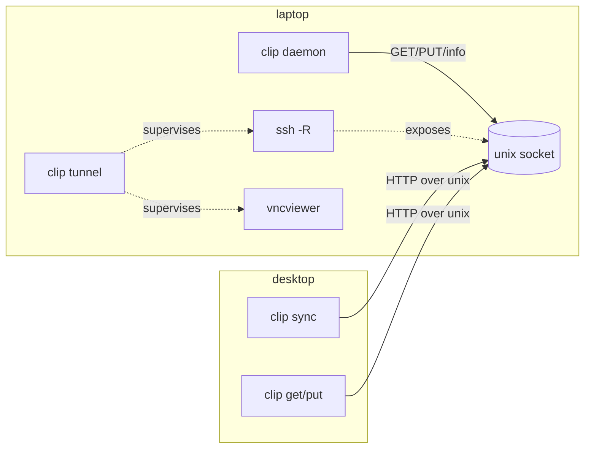

# Architecture: `clip` — Go rewrite of the clip + remote-desktop tooling

Status: PROPOSAL-4 (ratified)
References: REQUEST `plabs-wn1`, ELICIT `plabs-1zs`, URD `plabs-ebt`

## 1. Context

Today the clipboard + remote-desktop tooling is split across Python and shell:

| Artifact | Language | Role |
|---|---|---|
| `modules/home-manager/services/clipd/clipd.py` | Python | `clipd`: HTTP-over-unix-socket daemon serving the laptop's `wl-clipboard` (`GET`/`PUT`/`info`) |
| `packages/clip/clip.py` | Python | `clip` CLI: `get`/`put`/`info`/`ping` against a peer socket |
| `packages/clip/clip-sync.py` | Python | Bidirectional reconciler between a local clipboard and a peer |
| `modules/home-manager/programs/remote-desktop/default.nix` | inline shell | Laptop `remote-desktop`: launches the VNC viewer and supervises an `ssh -R` for the clipd socket |
| `modules/nixos/services/remote-session/default.nix` | inline shell | Desktop persistent sway + wayvnc session; runs `clip-sync` against the session |

This works but requires a Python runtime, has shell-based lifecycle management, and is awkward to distribute. The goal is one small, static, testable Go binary with the same behavior, plus a clear design a new team can implement.

## 2. Goals / non-goals

**Goals** (from URD `plabs-ebt`)
- G1. Parity: text `text/plain` + `image/png`; bidirectional sync with no feedback loop.
- G2. Single multi-call Go binary `clip`, static (`CGO_ENABLED=0`), cross-compilable.
- G3. Include the tunnel manager by supervising the external `ssh` binary and the viewer.
- G4. YAML config + flags; structured logging; graceful shutdown.
- G5. Package via `buildGoModule`; portable release binaries + systemd unit templates.
- G6. Hand-off quality: documented interfaces, unit + integration tests, release process.

**Non-goals**
- N1. No native Go SSH transport/auth (no `golang.org/x/crypto/ssh` remote-forward).
- N2. No new wire protocol/transport (no TCP/TLS/token auth this iteration).
- N3. No Go rewrite of the NixOS/home-manager module wiring.
- N4. No port of the remote-session sway/wayvnc wrappers or general `scripts/` glue.
- N5. No TUI and no clipboard-history storage: `clipse` remains the history manager/TUI; our tools must coexist with it on the same session clipboard.
- N6. No `sd_notify`/`Type=notify` this iteration (deferred; see §19).

## 3. Problem space

- **Axes:** distribution (portability + Nix), reliability (sync convergence, tunnel lifecycle), ergonomics (single binary, config).
- **Is-a / has-a:** `clip` *is* a multi-call CLI; *has* a daemon mode (server), a client mode, a reconciler, and a tunnel manager. The reconciler *has* two clipboard endpoints (`local`, `peer`). The tunnel manager *has* an ssh master, a forward, and a supervised viewer.
- **Trust model:** the peer socket is a unix socket in the user's runtime dir, exposed to the peer via `ssh -R`. No app-layer auth; transport security is ssh. (Hardening this is future work, not this iteration.)

## 4. Architecture overview

```
              laptop (flowX13)                         desktop
  ┌───────────────────────────────────┐   ┌────────────────────────────────────┐
  │ session clipboard (Wayland)       │   │ remote-session clipboard (sway)    │
  │   ▲ wl-paste / wl-copy            │   │   ▲ wl-paste / wl-copy             │
  │   │                               │   │   │                                │
  │ clip daemon  ── unix socket ──┐   │   │ clip sync ── HTTP over unix ──┐    │
  │ (serves local clipboard)      │   │   │ (reconciler)                 │    │
  └───────────────────────────────┼───┘   └──────────────────────────────┼────┘
                                  │ ssh -R (supervised by `clip tunnel`) │
                                  ▼                                      ▼
                        /run/user/1000/clipd.sock  ◀── same path ──▶  peer socket
```

`clip` is one binary; the subcommand selects the mode:



## 5. Components

### 5.1 `clip daemon` (former `clipd`)
HTTP/1.1 server on a unix socket serving the local clipboard.

- `GET /clip` → `200 {"type":T,"data":base64}` or `204` if empty. Auto mode returns the first **non-empty** `text/plain`, else `image/png` (fixes the old empty-text-shadows-image bug).
- `GET /clip?type=T` → `200` / `204` / `415`.
- `GET /info` → `200 {"types":[...]}` (always includes both supported types).
- `PUT /clip` `{"type":T,"data":base64}` → `200 {"ok":true}` / `400` / `413` (body cap) / `415` / `500`.
**Socket ownership (single instance, atomic):**
- Acquire an exclusive `flock` on `<socket>.lock` for the daemon's lifetime; if it is already held, exit with an actionable error ("a clip daemon already owns <socket>"). This makes single-instance atomic rather than check-then-act.
- After holding the lock, remove the socket path **only if** it is a socket (`os.ModeSocket`) and a connect probe fails (dead). Never delete a non-socket path; never delete a live endpoint.
- On shutdown, `unlink` only the path this instance bound.

Implementation: `net.Listen("unix", …)` + `net/http` (`http.Serve`); request size capped with `http.MaxBytesReader`; socket mode `0600`; per-request read/write deadlines.

### 5.2 `clip get|put|info|ping` (client)
Same CLI and exit codes as today. `get` writes raw bytes to stdout; `put` reads stdin; `ping` is `GET /info` with a short timeout; `--socket`/config override.

### 5.3 `clip sync` (reconciler)
Bidirectional, loop-free, with an explicit startup/conflict policy. State is two hashes — `lastPeer`, `lastLocal` — both unset initially. Reads are tri-state: **value** (non-empty), **empty** (204), **error**. Empty does not sync (clearing is out of scope) and errors never advance state.

```
onConflict = config.sync.on_conflict   # "peer" | "local"; default "peer" (the daemon side wins)
loop every interval:
    peer,  peerErr  = peerRead()    # value | empty | error
    local, localErr = localRead()   # value | empty | error

    if peerErr != nil or localErr != nil:
        continue                     # cannot reconcile safely: NO writes, NO state change this tick

    peerChanged  = peer  is value and hash(peer)  != lastPeer
    localChanged = local is value and hash(local) != lastLocal

    if peerChanged and localChanged:                 # conflict, including startup
        winner = onConflict == "peer" ? peer : local
        loser  = winner == peer ? local : peer
        if write(loser <- winner): lastPeer = lastLocal = hash(winner)
    elif peerChanged:
        if localWrite(peer): lastPeer = lastLocal = hash(peer)
    elif localChanged:
        if peerPut(local):   lastPeer = lastLocal = hash(local)
    # else: no change (or error) -> do nothing; retry next tick
```

- **Read errors skip the whole tick.** If *either* side fails to read (e.g. the tunnel is down), the tick performs **no writes and advances no state**, so a stale local selection can never be pushed while the peer is unreadable.
- **Startup:** both hashes unset, so if both sides hold content they are "changed" and resolve by `onConflict` — by default the peer (laptop) wins and is copied to local. A stale local selection is therefore **not** pushed at startup.
- `last*` advance **only after a successful write**, so a failed write is retried rather than silently lost.
- Representation choice is identical on both sides (non-empty `text/plain`, else `image/png`), so hashes are comparable.
- I/O is bounded: `sync.read_timeout` (default 5s) and `sync.write_timeout` (default 10s).
- Empty (204) never propagates: clipboard *clears* are out of scope.

### 5.4 `clip tunnel` (remote-desktop orchestration)
Owns the lifecycle that is currently shell in the `remote-desktop` wrapper.

**CLI parity:** `clip tunnel [--host H] [--port P] [--ssh PATH] [--no-tunnel] -- <viewer argv...>`. Defaults come from config; `host`/`port` mirror the wrapper's positional args; `--no-tunnel` launches the viewer without forwarding (parity with a viewer-only run). The TigerVNC clipboard-disable settings (`AcceptClipboard=0`, …) stay in home-manager's `default.tigervnc`; `clip tunnel` does **not** manage the viewer's config file.

**Compatibility entrypoint (production cutover):** the user-facing command stays `remote-desktop [host] [port]`. Keep a thin launcher (the Nix-provided wrapper, now a one-liner) that maps its positional args to `clip tunnel`: `exec clip tunnel --host "${1:-<cfg.host>}" --port "${2:-<cfg.port>}" -- <viewer>`. No user-facing CLI change.

Nix option mapping (`CUSTOM.programs.remote-desktop` → `clip tunnel`):
- `host` → `--host`; `port` → `--port`.
- `viewer` supplies the runtime **package** (as today, for `home.packages`/PATH); `viewerCommand` is the **binary name** used as the viewer argv after `--` (default `vncviewer`).
- `clipTunnel.socketPath` → **both** `tunnel.local_socket` and `tunnel.remote_socket` (the current module forwards the same path on both ends). Validate that a non-default path reaches **both** `-R` operands.
- `environment.variables.SSH_AUTH_SOCK`/agent availability → master authentication.
- `clipTunnel.enable = false` → the launcher runs the viewer directly with **no ssh invocation** (equivalent to `--no-tunnel`).
- The TigerVNC clipboard-disable settings (`AcceptClipboard=0`, …) remain in home-manager's `default.tigervnc`; `clip tunnel` does **not** manage the viewer's config file.

**Lifecycle:**
1. Resolve config (`host`, `port`, `ssh`, `local_socket`, `remote_socket`, `viewer`) and a single **`controlPath`** (default `~/.ssh/clip-%h`). **Every** master operation below uses this same resolved path.
2. Ensure the master: `ssh -o ControlPath=<controlPath> -o ControlMaster=auto -o ControlPersist=yes -fN <host>`, using a finite `ConnectTimeout` (default 10s) and a **bounded retry policy** (default 2 retries with backoff), while preserving interactive authentication. Then verify with a **bounded** `ssh -o ControlPath=<controlPath> -O check <host>` (timeout 5s); recreate if stale/absent. If the host is unreachable, exit non-zero **without launching the viewer**. Creation may prompt for a passphrase (foreground/tty) before forking; non-interactive contexts require an agent or `SSH_ASKPASS` — documented, actionable error otherwise.
3. Add the forward with a timeout: `ssh -o ControlPath=<controlPath> -O forward -R <remote>:<local> <host>`. On "address already in use", run a bounded remote pre-clean (unlink the remote socket iff not listening, over a non-multiplexed `ssh`), then retry once. Desktop sshd also sets `StreamLocalBindUnlink=yes`.
4. Supervise the viewer (`viewer... <host>:<port>`). If forwarding failed, **do not** launch the viewer; exit `1`.
5. On viewer exit, `SIGINT`, `SIGTERM`, or `SIGHUP`: `ssh -o ControlPath=<controlPath> -O cancel -R <remote>:<local> <host>` with a bounded timeout (5s); if cancel fails, log it and leave the master (do not kill it), then terminate any supervised transient children. Return the viewer's exit code.
6. Bounded shutdown deadline applies to all cleanup; structured JSONL logs each step.

**Persistent master vs orphans:** the ssh master is **intentionally persistent** (`ControlPersist`) so the passphrase is entered at most once and later launches reuse it — it is not an orphan. Only transient children (viewer, pre-clean ssh) are terminated. Operators can inspect it with `ssh -o ControlPath=<controlPath> -O check <host>`.

**Migration/compatibility validation:** `remote-desktop` with no args (config host/port), with explicit host/port, with `clipTunnel.enable = false` (no ssh), and with an existing master (reuse, no prompt) all behave identically to today from the user's perspective.

## 6. CLI surface

Parsed and presented with `charmbracelet/fang` (Cobra-based): styled help, `--version`/commit, and man pages. Subcommands remain stable.

```
clip [--config PATH] <command> [flags]

  daemon    [--socket PATH] [--log-level L]
  get       [TYPE] [--socket PATH]
  put       [TYPE] [--socket PATH]
  info|ping [--socket PATH]
  sync      [--socket PATH] [--interval DUR] [--types a,b]
  tunnel    [--host H] [--ssh PATH] -- <viewer argv...>
  version
```

`--socket` defaults to `$CLIP_SOCKET`, else the config `socket`, else `$XDG_RUNTIME_DIR/clipd.sock` (via `adrg/xdg`; never a hardcoded `/run/user/1000`).

**Parity contract (preserve exactly):**
- Global flags: `--config PATH`, `--socket PATH`; env `CLIP_SOCKET`, `CLIP_CONFIG`.
- MIME aliases accepted by `get`/`put`: `text` → `text/plain`, `png`/`image` → `image/png`.
- `info` prints one MIME type per line, always including `text/plain` and `image/png` (as the daemon does today).
- `ping` is `GET /info` with a short timeout; exit non-zero if unreachable.
- Exit codes: `0` success; `1` runtime error (unreachable daemon, failed transfer); `2` usage error. (No new code `3`; this matches the current `clip`/`clipd` behavior.)

## 7. Configuration (YAML) + flags

Precedence: **flags > env > config file > defaults**. Default path: `$XDG_CONFIG_HOME/clip/config.yaml` (`CLIP_CONFIG` overrides). Runtime paths resolve via `adrg/xdg`, never hardcoded.

```yaml
# ~/.config/clip/config.yaml
socket: ${XDG_RUNTIME_DIR}/clipd.sock   # CLIP_SOCKET overrides
types: [text/plain, image/png]
sync:
  interval: 1s
  on_conflict: peer        # peer|local — winner when both sides changed (incl. startup)
  read_timeout: 5s
  write_timeout: 10s
clipboard:
  wl_copy: wl-copy         # resolved from PATH by default
  wl_paste: wl-paste
log:
  level: info              # error|warn|info|debug (CLIP_LOG_LEVEL overrides)
  format: jsonl            # jsonl|text
tunnel:
  host: desktop
  ssh: ssh
  local_socket: ${XDG_RUNTIME_DIR}/clipd.sock
  remote_socket: ${XDG_RUNTIME_DIR}/clipd.sock
  viewer: [vncviewer]
```

Env vars: `CLIP_CONFIG`, `CLIP_SOCKET`, `CLIP_LOG_LEVEL` (flags win). Schema validation: unknown keys are a warning; wrong types or invalid enums are a hard, actionable error.

Dependency: `knadh/koanf` with the YAML provider (pure Go, static-friendly).

## 8. Logging, signals, exit codes

- Logging: stdlib `log/slog` with the JSON handler to stderr for `daemon`/`sync`; `charmbracelet/log` (styled) is optional for interactive commands. Never log clipboard contents; one event per state change (bind, request error, sync write, tunnel add/cancel).
- Signals: `SIGINT`/`SIGTERM` → graceful shutdown with a bounded deadline (stop accepting, cancel the forward, kill supervised children). `SIGHUP` in `tunnel`/`sync` → same teardown (no orphaned ssh).
- Exit codes: `0` success; `1` runtime error (including unreachable peer/tunnel); `2` usage. (Parity with the current tools; no new `3`.)
- Auth: the tunnel uses key/agent auth; if a passphrase is required and no agent holds the key, ssh prompts once to create the master.

## 9. Systemd + Nix integration

Map 1:1 onto today's units, replacing the Python wrapper with `clip`:

| Unit | Today | After |
|---|---|---|
| `clipd.service` (user) | `python3 clipd.py %t/clipd.sock` | `clip daemon --config %t/clip.yaml` |
| `clip-sync.service` (user, login session) | `clip-sync <socket> <interval>` | `clip sync --config %t/clip.yaml` |
| `clip-peer-sync.service` (system, remote-session) | `clip-sync <socket> <interval>` | `clip sync --config /run/user/<uid>/remote/clip.yaml` |

- Readiness stays `Type=simple` with the existing `StartLimitIntervalSec=0` + retry settings; `sd_notify`/`Type=notify` is explicitly deferred (N6).

Nix: `pkgs.buildGoModule` (or `buildGoApplication` with `gomod2nix`) producing `clip`; modules reference `${clip}/bin/clip`. Add `vendorHash` and update on dependency changes.

## 10. Distribution

- Static: `CGO_ENABLED=0 go build ./...`; matrix `{linux,darwin}×{amd64,arm64}` via a small release workflow (`goreleaser` or a Make target). Note: functionality is Linux/Wayland + ssh; darwin builds are for the client only if desired.
- Release artifacts: tarballs with `clip`, example `config.yaml`, and `contrib/*.service` unit templates.
- Nix: flake package `clip` + cache; modules consume it.

## 11. Security

- Socket is `0600` in the user runtime dir; only same-user processes (or the peer tunnel) can connect.
- Transport security is ssh; no app-layer auth this iteration (documented; future: token/TLS).
- The tunnel exposes the local clipboard to the peer while the forward exists; `cancel` on exit limits the window.
- Do not log clipboard contents.

## 12. Testing strategy

- **Unit:** protocol handlers (status codes, empty vs missing, 415/413), reconciler transitions (startup conflict, peer→local, local→peer, no-loop on echo, failed-write retry), config precedence/validation, CLI parsing + aliases + exit codes.
- **Daemon ownership:** second daemon is refused while the lock is held; a stale (dead) socket is removed; a non-socket path is never removed; socket mode is `0600`.
- **Integration:** in-process unix socket client/server; a fake `wl-copy`/`wl-paste` (the existing mock harness) proving:
  - startup with unequal **non-empty** clipboards resolves by policy (peer wins by default), with no local→peer push;
  - startup with an **empty local** clipboard copies peer→local;
  - **write counts** over subsequent ticks show no echo;
  - **convergence after an injected write failure** (state not advanced, retried);
  - a **peer-read failure while writes remain available** performs no write and no state change until reads succeed, then applies peer-wins.
- **Compatibility:** `remote-desktop` with no args, explicit host/port, and `clipTunnel.enable = false` (no ssh) behave as today.
- **Tunnel:** a fake `ssh` on `PATH` recording `-O forward`/`-O cancel` plus a fake viewer:
  - master is created once and **reused** on a second run (persistent master survives viewer exit);
  - transient children are terminated; `cancel` fires on `SIGINT`, `SIGTERM`, and `SIGHUP`;
  - viewer exit code is propagated;
  - the viewer is **not** launched when forwarding fails.
- **E2E (scripted):** laptop daemon + desktop sync over a local unix socket pair simulating the tunnel; daemon/sync graceful shutdown within the deadline.
- **Static build:** `CGO_ENABLED=0 go build -o dist/clip ./cmd/clip` from `packages/clip-go`, then assert `ldd dist/clip` reports a non-dynamic executable.

## 13. Migration / cutover

1. Land `packages/clip-go/` with parity tests; keep Python in place.
2. Switch the three systemd units to `clip`; run both side by side in a staging host.
3. Remove `clipd.py`, `clip.py`, `clip-sync.py` and the Python packaging.
4. Update docs (`docs/remote-clipboard.md`) and units.
Rollback: revert units to the Python wrappers (store paths remain until GC).

## 14. Engineering tradeoffs

| Decision | Pros | Cons | Choice |
|---|---|---|---|
| Single binary vs several | one artifact, shared config/logging | bigger single unit; subcommand dispatch | single (D2) |
| YAML vs TOML vs flags-only | YAML already used in repo tooling, expressive | extra dep (`yaml.v3`) | YAML (D3) |
| Supervised ssh vs native Go SSH | reuses ssh hardening/config/agent; days vs weeks | depends on `ssh` binary behavior | supervised (D1) |
| Go vs Zig | stdlib + ecosystem; trivial static | larger binaries than Zig | Go |
| Monorepo vs separate repo | simplest wiring; same CI | less clean external handoff | monorepo (D4) |

## 15. Public interfaces (Go)

```go
package clip // protocol types

type Type string
const ( Text Type = "text/plain"; PNG Type = "image/png" )

type Data struct { Type Type; Bytes []byte }

// package ctl — client for the daemon protocol
type Client struct{ Socket string; HTTP *http.Client }
func (c *Client) Get(ctx context.Context, t Type) (Data, bool, error) // bool=false => 204
func (c *Client) Put(ctx context.Context, d Data) error
func (c *Client) Info(ctx context.Context) ([]Type, error)

// package clipboard — local clipboard backend
type Clipboard interface {
    Read(ctx context.Context) (Data, bool, error)  // non-empty text/plain, else image/png
    Write(ctx context.Context, d Data) error
}
func NewWLClipboard(copyBin, pasteBin string) Clipboard

// package sync
type Peer interface { Read(ctx context.Context) (Data, bool, error); Write(ctx context.Context, d Data) error }
type Reconciler struct { Local Clipboard; Peer Peer; Interval time.Duration; Log *slog.Logger }
func (r *Reconciler) Run(ctx context.Context) error

// package tunnel
type Tunnel struct { SSH, Host, Local, Remote string; Viewer []string; Log *slog.Logger }
func (t *Tunnel) Run(ctx context.Context) (int, error) // ensures master, adds forward, supervises viewer, cancels
```

## 16. Validation checklist

- [ ] `clip daemon` takes an exclusive lock (a second daemon is refused), removes a stale socket **only** if it is a socket and dead, never removes a non-socket path, binds `0600`, and answers `GET /clip`, `GET /clip?type=`, `GET /info`, `PUT /clip` with parity errors (`400/413/415`).
- [ ] `clip get`/`put` round-trip text and PNG over a unix socket; MIME aliases and exit codes match the current CLI.
- [ ] `clip sync`: startup with unequal non-empty clipboards resolves by policy (peer wins by default, no local→peer push); empty local copies peer→local; subsequent ticks show no echo (write-count assertions); an injected write failure does not advance state and is retried; a **peer-read failure** performs no write/state change until reads succeed.
- [ ] `remote-desktop` compatibility: no-arg, explicit host/port, and `clipTunnel.enable = false` (no ssh) match current behavior; every ssh master operation uses the one resolved `ControlPath`; a non-default `clipTunnel.socketPath` reaches **both** `-R` operands; an unreachable host exits non-zero without launching the viewer.
- [ ] Empty `text/plain` alongside `image/png` yields the image from the daemon.
- [ ] `clip tunnel`: creates/reuses a persistent master; adds `-R`; does **not** launch the viewer if forwarding fails; cancels the forward on viewer exit, `SIGINT`, `SIGTERM`, and `SIGHUP`; terminates transient children; propagates the viewer's exit code; the persistent master is left intact.
- [ ] Config precedence (flag > env > file > default), env vars (`CLIP_CONFIG`/`CLIP_SOCKET`/`CLIP_LOG_LEVEL`), and YAML schema validation.
- [ ] Static build: `CGO_ENABLED=0 go build -o dist/clip ./cmd/clip` from `packages/clip-go`; `ldd dist/clip` is non-dynamic.
- [ ] `buildGoModule` evaluates and builds in the flake; modules reference `${clip}/bin/clip`.
- [ ] Structured JSONL logs on stderr with no clipboard contents.

## 17. BDD acceptance criteria

- **Given** a laptop daemon and a desktop reconciler over a unix socket, **When** the user copies `hello` on the laptop, **Then** the desktop clipboard becomes `hello`, **And Should Not** push it back to the peer.
- **Given** both clipboards hold different non-empty values at sync startup, **When** the first tick runs, **Then** the peer value is written to local by default (`on_conflict: peer`), **And Should Not** push the local value to the peer.
- **Given** the desktop clipboard changed to `world` and the peer still holds `hello`, **When** the next sync tick runs, **Then** `world` is written to the peer, **And Should Not** echo `world` back to the desktop.
- **Given** a write to the peer fails, **When** the next tick runs, **Then** the reconciler retries without having advanced its state, **And Should Not** drop the change.
- **Given** the peer is unreadable while the local clipboard still holds a value, **When** sync ticks run, **Then** no write occurs and no state advances, **And Should Not** push the stale local value to the peer.
- **Given** the `remote-desktop` compatibility launcher, **When** invoked with no args, with explicit host/port, or with `clipTunnel.enable = false`, **Then** behavior matches today, **And Should Not** invoke ssh when the tunnel is disabled.
- **Given** a non-default `clipTunnel.socketPath`, **When** `clip tunnel` adds the forward, **Then** both `-R` operands use that path, **And Should Not** fall back to the default socket.
- **Given** an unreachable host, **When** `clip tunnel` starts, **Then** it exits non-zero without launching the viewer, **And Should Not** leave a partial master or forward.
- **Given** the peer clipboard offers an empty `text/plain` plus `image/png`, **When** `GET /clip` is requested, **Then** the response is the PNG, **And Should Not** return empty text.
- **Given** an unsupported MIME type, **When** `PUT /clip` is called, **Then** the daemon returns `415`, **And Should Not** alter the clipboard.
- **Given** `clip tunnel` with a running viewer, **When** the viewer exits or the process receives `SIGHUP`, **Then** the `-R` forward is cancelled and transient children are terminated while the intentional master persists, **And Should Not** require re-authentication on the next launch.
- **Given** `clip tunnel` cannot add the forward, **When** it would launch the viewer, **Then** it exits `1` without launching the viewer, **And Should Not** leave a partial forward.
- **Given** a build with `CGO_ENABLED=0` (`go build -o dist/clip ./cmd/clip`), **When** the binary is inspected with `ldd`, **Then** it is non-dynamic, **And Should Not** require a Python runtime.

## 18. Risks / open questions

- R1. `ssh -O forward` availability/semantics across OpenSSH versions (target ≥ 8.x); fallback to a dedicated `-fN -R` connection if `-O` is unsupported.
- R2. `log/slog` requires Go ≥ 1.21; confirm the toolchain pinned in the flake.
- R3. YAML adds a dependency; if zero-deps is a hard requirement, fall back to flags/env + a minimal parser.
- R4. Two reconcilers (login session + remote session) sharing one peer can contend last-writer; out of scope but document.
- R5. Release workflow target set (darwin client-only vs full matrix) needs a decision before packaging.

## 19. Dependencies and library choices

| Area | Choice | Notes |
|---|---|---|
| CLI | `charmbracelet/fang` (Cobra + Lipgloss + Glamour) | subcommands, styled help, `--version`/commit, man pages |
| Config | `knadh/koanf` (+ YAML provider) | precedence flag > env > file > default without hand-rolled merge |
| XDG paths | `adrg/xdg` | `$XDG_CONFIG_HOME`/`$XDG_RUNTIME_DIR`; no hardcoded `/run/user/1000` |
| Concurrency | `golang.org/x/sync/errgroup` | daemon/sync/tunnel goroutine lifecycle and cancellation |
| Logging | stdlib `log/slog` (JSONL) for daemon/sync; optional `charmbracelet/log` for interactive mode | never log clipboard contents |
| Testing | stdlib `testing` + `google/go-cmp` | table tests + the mock `wl-clipboard` harness |
| Release | `goreleaser` (tooling) | static matrix, checksums, unit templates |

Explicitly **not** adopted:
- `bubbletea`/`bubbles`/`lipgloss` as a TUI — no `clip tui`; `clipse` remains the history/TUI. (Lipgloss/Glamour still arrive transitively via `fang`.)
- `github.com/coreos/go-systemd/v22/daemon` (`sd_notify`) — sensible and well-maintained, but judged overkill for now; keep `Type=simple`. Revisit only if a startup race appears.
- Any third-party SSH library — the tunnel supervises the `ssh` binary.

All are pure Go, so `CGO_ENABLED=0` static builds remain valid. Nix vendoring via `buildGoModule` `vendorHash` (or `gomod2nix`).

## 20. Project layout (inspired by `clipse`)

Adapted from `savedra1/clipse`'s shape (`cmd/`, `config/`, `display/`, `handlers/`, `shell/`, `utils/`) to our transport/sync roles and Go's `internal/` convention:

```
packages/clip-go/
  go.mod                # module: github.com/dayvidpham/dotfiles/packages/clip-go (extractable later)
  cmd/clip/main.go      # fang entrypoint; wires subcommands
  internal/
    cli/                # fang command definitions: daemon, get, put, info, ping, sync, tunnel
    config/             # koanf load + precedence + xdg default resolution + validation
    protocol/           # wire types (Data, Type), request/response encoding
    daemon/             # HTTP-over-unix-socket server
    ctl/                # client for the daemon protocol
    clipboard/          # local clipboard backend
      clipboard.go      #   Clipboard interface
      wl.go             #   wl-clipboard implementation (wl-copy/wl-paste)
      types.go          #   MIME constants + PNG magic-byte detection (text/plain, image/png)
    shell/              # command construction/constants (argv builders) — unit-testable
    sync/               # reconciler (two-hash algorithm, conflict policy)
    tunnel/             # supervised ssh master + -R add/cancel + viewer lifecycle
    log/                # slog setup (JSONL), level/format
  testdata/             # fixtures + fake wl-clipboard / fake ssh
```

Patterns borrowed from `clipse`:
- A dedicated **`shell/` layer** that builds external commands from constants (paths/flags) instead of scattering argv literals — makes `wl-copy`/`wl-paste`/`ssh` invocations unit-testable (clipse uses `wlCopyHandler`, `wlTypeSpec`, `wlCopyImgCmd` the same way).
- **PNG magic-byte detection** (`89 50 4E 47`) rather than trusting caller-supplied MIME. (JPEG is out of scope — we carry only `text/plain` and `image/png`.)
- **Config-file + temp-dir conventions** and a `constants` package for defaults.
- *Future/optional:* clipse's per-type watcher model (`wl-paste --type … --watch`) is noted as prior art but **not** built now; our reconciler polls by design and we avoid unused scaffolding.

## 21. Prior art / inspiration

- **`savedra1/clipse`** — Go clipboard manager; primary structural inspiration (package layout, `shell/` constants layer, magic-byte image detection, `wl-paste --type … --watch` + `--wl-store`). We deliberately do **not** reimplement its history/TUI; `clipse` stays, and our tools coexist with it on the same session clipboard.
- **`bugaevc/wl-clipboard`** — the external backend we shell out to (`--watch`, `--type`, `-t` on copy); pinned to the C implementation because `wl-clipboard-rs` lacks `--watch`.

## 22. Handoff notes

- Preserve the wire protocol and CLI exactly; the Nix modules depend on the subcommand surface and socket semantics.
- The reconciler algorithm (§5.3) is the load-bearing behavior; keep the "seed from peer, never echo" invariant and its tests.
- The tunnel is intentionally thin: it supervises `ssh` and the viewer; do not reimplement SSH.
- Suggested first slices: (1) `ctl` + `clip daemon`, (2) `clip get/put/info/ping`, (3) `clip sync` + harness, (4) `clip tunnel`, (5) Nix packaging + unit swap, (6) docs/cleanup.
